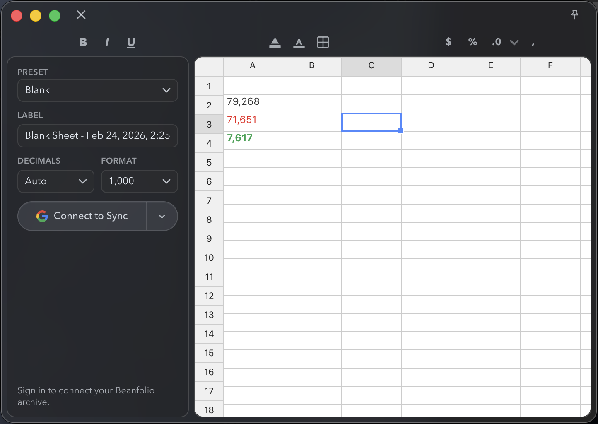

# Beanfolio

Beanfolio is a lightweight spreadsheet app for accounting and finance students.
It runs as a macOS desktop app (Electron), and can append your work to a Google Sheets archive.

## Screenshot



## What It Does

- Spreadsheet grid powered by Handsontable + HyperFormula
- Fixed-size workbook (`120` rows x `12` columns) with in-app scrolling
- Presets:
  - `Blank`
  - `Journal Entry`
  - `T-Account`
- Formatting toolbar:
  - fill/text color picker with lightness slider
  - bold, italic, underline
  - percent, rounding, comma formatting
  - absolute reference toggle (`A1 -> $A$1 -> A$1 -> $A1`)
- Formula helper/autocomplete with accounting/finance-focused functions
- Google OAuth sign-in and save-to-archive workflow
- Save appends:
  - 4 blank spacer rows
  - optional label row
  - trimmed data block (trailing empty rows removed)

## Formula Helper Coverage

Includes common spreadsheet and accounting/finance functions, including:
`RATE`, `NPER`, `IPMT`, `PPMT`, `MIRR`, `EFFECT`, `NOMINAL`, `SLN`, `SYD`, `DB`, `DDB`, `EDATE`, `EOMONTH`, `YEARFRAC`, `NETWORKDAYS`, `SUMIFS`, `COUNTIFS`, `AVERAGEIFS`, `INDEX`, `MATCH`, `XNPV`, and core formulas like `SUM`, `IF`, `ROUND`, `PV`, `FV`, `PMT`, `IRR`, `NPV`.

## Tech Stack

- React + TypeScript + Vite
- Handsontable + HyperFormula
- Electron (desktop app)
- Google Drive/Sheets APIs

## Setup

1. Create OAuth credentials in Google Cloud Console (Web app).
2. Enable:
   - Google Sheets API
   - Google Drive API
3. Add authorized JavaScript origins:
   - `http://localhost:5173`
   - `http://127.0.0.1:5180`
4. Copy `.env.example` to `.env` and set `VITE_GOOGLE_CLIENT_ID`.

## Run (Desktop Dev)

```bash
npm install
npm run dev
```

Note: dev mode launches the Electron binary directly, so macOS may show `Electron` in the app menu.

## Desktop from Built Assets

```bash
npm run desktop
```

This launches the packaged `Beanfolio.app` (menu bar name shows `Beanfolio`).

## Electron Binary Run (Fast)

```bash
npm run desktop:electron
```

## Build

```bash
npm run build
```

## Internal Web Debug (Optional)

```bash
npm run dev:web
npm run preview:web
```

## Deploy to GitHub Pages

This repo includes a workflow at `.github/workflows/deploy-pages.yml` that builds and deploys from `dist/`.

1. In GitHub repo settings, set **Pages** source to **GitHub Actions**.
2. Push to `main` (or run the workflow manually).
3. The workflow uses:
   - `npm ci`
   - `npm run build:pages`
   - deploy `dist/` to Pages

Why this matters: GitHub Pages cannot run Vite/TypeScript directly. It must serve built assets from `dist/`, not `src/main.tsx`.

## Package macOS App

```bash
npm run dist:mac
npm run dist:mac:dir
```

## Test

```bash
npm test
```

## Current Limitations

- Archive is append-only; no in-app browsing/editing of historical saves
- No multi-sheet workbook management in UI
- Some Excel functions (for example `XIRR`, `XLOOKUP`) are not yet surfaced

## Roadmap / TODO

- Testing and reliability:
  - Add edge-case tests for formulas, reference replacement, and style application
  - Add tests for very sparse/very dense save payloads and unusual value types
  - Add regression tests for toolbar focus/selection behavior
- Templates and workflow:
  - Implement a template library (amortization schedules, bank rec, adjusting entries, trial balance)
  - Add template metadata and quick-start descriptions for students
- Spreadsheet feature depth:
  - Expand formula support and helper docs
  - Add range drag/fill ergonomics and smarter autofill patterns
  - Add keyboard shortcut parity improvements
- Accounting-first UX:
  - Debit/credit balancing checks and warnings
  - Guided journal-to-ledger workflows
  - Trial balance and statement-generation helpers
- Data and export:
  - Add import/export options (CSV and assignment-friendly PDF)
  - Add save history/version snapshots with restore points
- Quality of life:
  - Better error messaging for OAuth and Google API failures
  - Performance tuning for larger formulas and heavy formatting use
